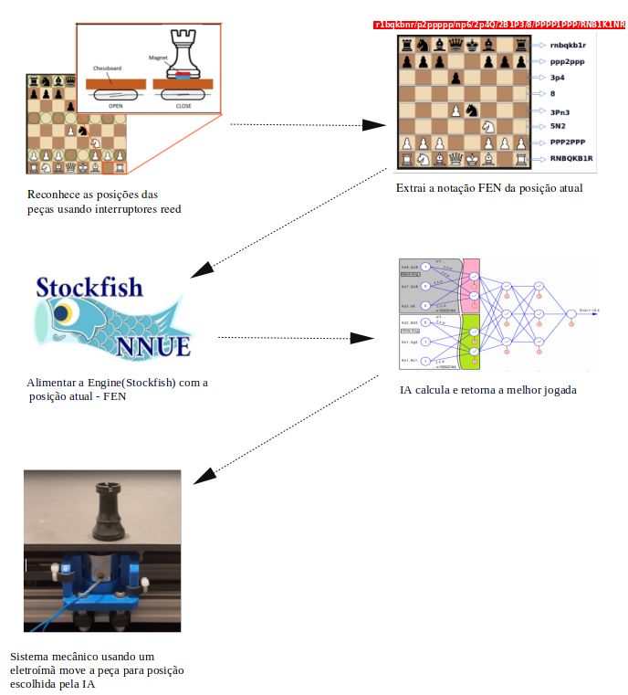
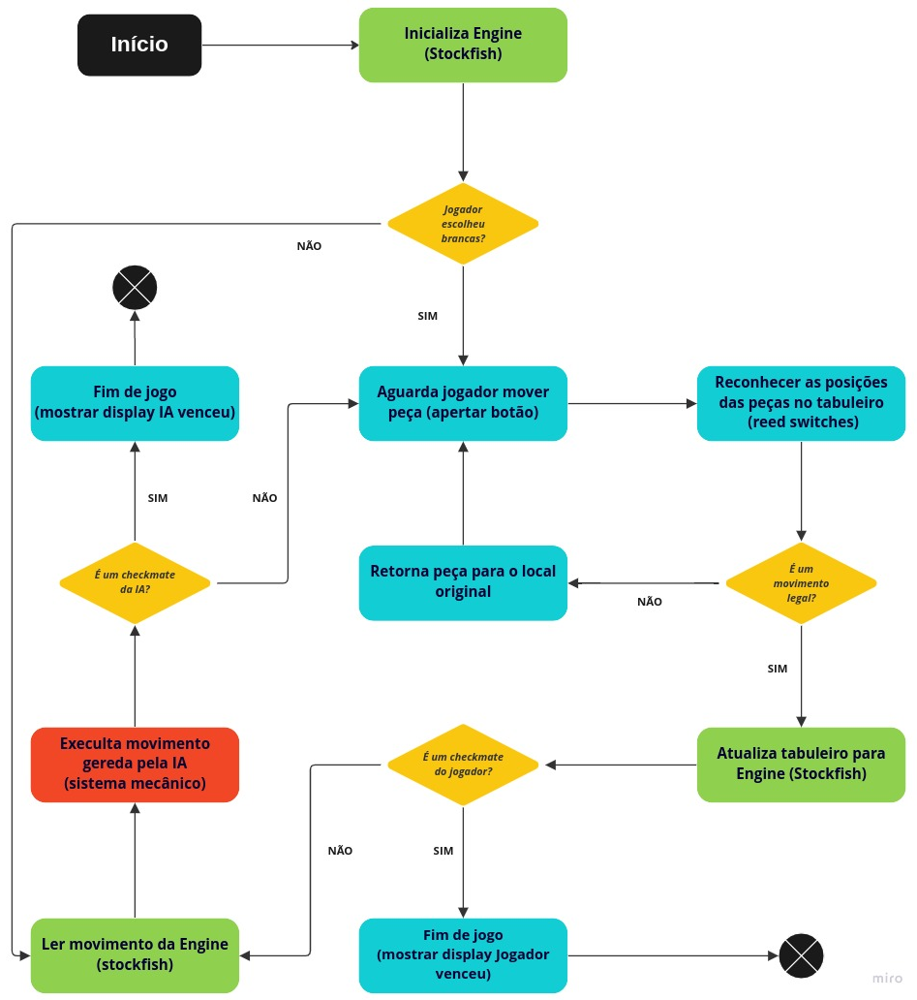
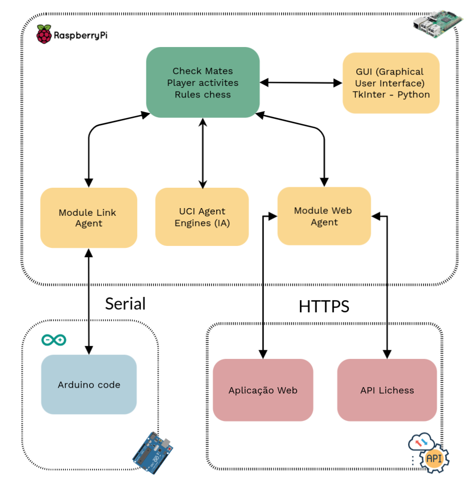

# Produto

## Documento de Arquitetura

&emsp;&emsp;A finalidade deste documento é detalhar os componentes, tecnologias e diferentes visões arquiteturais do CHECK MATES, a fim de facilitar o entendimento dos processos envolvidos no desenvolvimento e todo o funcionamento do produto. A aplicação será desenvolvida na disciplina de Projeto Integrador 2 da Universidade de Brasília.

#### Escopo

&emsp;&emsp;Este trabalho visa projetar e construir um dispositivo de xadrez mecanizado, permitindo aos usuários jogar contra uma inteligencia artificial (StockFish) em um tabuleiro físico. Um eletroímã irá executar os movimentos gerados por uma IA, movendo as peças físicas, de maneira geral, imitando um verdadeiro especialista em xadrez.

[Figura 1 -  Resumo do funcionamento do  CHECK MATES](./assets/images/doc-arquitetura/doc_arquitetura_img_1.png)

#### Diagrama de fluxo do software

&emsp;&emsp;O software principal forma uma interface entre o usuário, a Engine do StockFish e o sistema de movimentos do computador para passar para o software do Arduíno que controla o motor.

[Figura 2 -  Fluxograma do software humano contra IA](./assets/images/doc-arquitetura/doc_arquitetura_img_2.png)

#### Arquitetura do software

&emsp;&emsp;Ele roda a partir de um Arduino que gerencia e controla em tempo real sensores, motores, eletroímã e etc. Estando este, conectado a um Raspberry PI que roda a Engine (Stockfish), a biblioteca de regras de xadrez e a interface gráfica.

[Figura 3 -  Diagrama de Blocos principais módulos do software](./assets/images/doc-arquitetura/doc_arquitetura_img_3.png)

